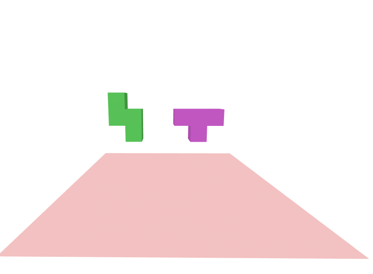
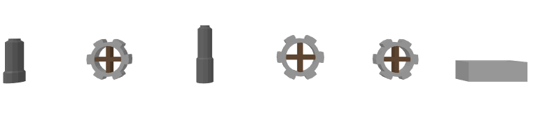

## Treinamento VR

Tecnologias de realidade aumentada se tornam cada vez mais comuns. Novos celulares, com suas grandes telas, permitem que grande parte da população possa ter um óculos VR. Estas tecnologias já estão em uso em indústrias de alta tecnologia. Realidade aumentada pode ajudar um engenheiro a visualizar uma peça antes de entrar em produção e pode ser usada para o treinamento dos funcionários de manufatura. Este projeto foca neste segunda aspecto.

Neste projeto idealizamos um protótipo para treinamento de montagem de peças de um avião. O programa deve instruir o usuário e permitir que este realiza a montagem da peça disponibilizando _feedback_ e uma avaliação final. O projeto será baseado em tecnologias _web_ para aproveitar da alta acessibilidade que elas tem.

Um protótipo mostrando a capacidade das tecnologias já disponíveis no mercado foi criado usando a biblioteca WebVR e pode ser acessado [aqui][2] ou clicando a imagem abaixo.

[][1]

[][2]

[][3]

---

Este projeto esta sendo realizado para aula de _Laboratório de Desenvolvimento em Banco de Dados III_ do _Curso Superior de Tecnologia em Banco de Dados_ da FATEC Professor Jessen Vidal.

Membros do grupo:
- Alan Lucas
- Daniel Bolognesi
- Pedro Minicz
- Ruan Ramon

[1]: https://pedrominicz.github.io/model/tetris/
[2]: https://pedrominicz.github.io/model/transmission/
[3]: https://pedrominicz.github.io/model/gears/
